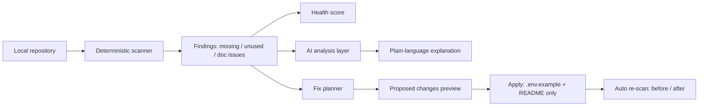

# EnvGuard

**Configuration health and consistency for software repositories.**

EnvGuard scans a repository for environment-variable usage, compares it against
`.env.example` / `docker-compose` / `README.md`, scores configuration
consistency, explains each issue in plain language, and proposes safe fixes —
all without ever exposing secret values.

## Problem

New developers clone a repo and it doesn't run: a `DATABASE_URL` is read in
code but missing from `.env.example`, an OAuth client ID is undocumented, a
stale `OLD_API_KEY` lingers for years. These inconsistencies waste developer
time on every onboarding and deploy. EnvGuard finds them in seconds.

## How it works



1. **Scan** (`POST /api/scan`) — deterministic walk of JS/TS sources, `.env*`,
   `docker-compose.*`, `README.md`. Variable **names only**, never values.
2. **Analyze** (`POST /api/analyze`) — provider-independent AI layer explains
   each issue: severity, why it matters, recommended fix, files to check.
   Works with zero credentials via a clearly labelled **Demo analysis** fallback.
3. **Fix** (`POST /api/fix` → preview, `POST /api/fix/apply` → apply) —
   appends `NAME=` placeholders to `.env.example`, documents vars in
   `README.md`. Unused vars are flagged for review, never auto-deleted.
   `.env` and source code are never touched.
4. **Re-scan** — automatic; shows before/after health.
5. **Reset** (`POST /api/demo/reset`) — restores the broken demo fixture.

## Architecture

- `frontend/` — React + Vite + Tailwind CSS dashboard (health score, issue
  cards with details, analysis panel, fix preview/apply, activity timeline).
- `backend/server.js` — Express API: `/api/health`, `/api/scan`,
  `/api/analyze`, `/api/fix`, `/api/fix/apply`, `/api/demo/reset`.
- `backend/scanner.js` — deterministic repo scanner + transparent
  `computeHealthScore()` (`100 − 15×missing − 5×unused − 3×docIssues`).
- `backend/services/aiAnalyzer.js` — `analyzeConfiguration(scan)`; uses a
  real provider only when `AI_PROVIDER=openai-compatible` + URL/key are set,
  otherwise the deterministic demo explainer.
- `backend/services/fixPlanner.js` — `planFixes()` / `applyPlan()` with
  allowlisted targets and rollback.
- `backend/demo-repo/` — intentionally broken fixture (missing
  `DATABASE_URL` / `GOOGLE_CLIENT_ID`, stale `OLD_API_KEY`, README gaps).
- `backend/demo-pristine/` — pristine copies used by demo reset.

## Tech stack

JavaScript throughout. React 18 + Vite 5 + Tailwind CSS 4 (frontend);
Node.js + Express 4 + CORS (backend). No database, no auth, no build
pipelines — state lives in the fixture files and in-memory UI state.

## Run locally

```bash
# backend (http://localhost:5000)
cd backend
npm install
npm run dev

# frontend (http://localhost:5173) — in a second terminal
cd frontend
npm install
npm run dev
```

Backend config: copy `backend/.env.example` to `backend/.env`.
Frontend config: `frontend/.env` sets `VITE_API_URL`.

## Demo instructions (2–3 minutes)

1. Open `http://localhost:5173`
2. Click **Scan Demo Repository**
3. See the configuration health score (**56 / 100**) and detected issues
4. Click **Analyze Configuration**, read the analysis (labelled Demo analysis)
5. Click **Fix Issues with Bob**, review the proposed changes
6. Click **Apply Fixes** — automatic re-scan shows **95 / 100**
7. Check the activity timeline
8. Click **Reset Demo** — the broken state (56 / 100) returns, ready to repeat

## Security considerations

- Scanner parses `.env` key names only; values are discarded at parse time.
- API responses, prompts, logs, and the UI contain variable names and
  metadata only — verified by automated leak checks (no secret substrings).
- `POST /api/fix/apply` refuses non-demo repositories (403) and can only
  write `.env.example` + `README.md`; `.env` and source files are protected
  by an allowlist plus a repository-root containment check.
- Generated `.env.example` entries are empty (`NAME=`); generated docs are
  placeholder instructions, never credentials.
- Failed applies roll back already-written files from in-memory originals.

## AI/provider configuration

Optional. Leave unset for the offline demo experience:

```bash
# backend/.env
AI_PROVIDER=openai-compatible
AI_API_URL=https://your-provider/v1
AI_API_KEY=your-key
AI_MODEL=granite-3-8b-instruct
```

Any provider failure falls back to Demo analysis without breaking the scan flow.

## Intentionally out of the MVP

Authentication, databases, GitHub OAuth/integration, chatbot or conversational
UI, general coding assistance, security-certification scoring, source-code
auto-edits, automatic deletion of unused variables, CI/CD and deployment
infrastructure. The health score is a configuration **consistency** heuristic,
not a security standard.
